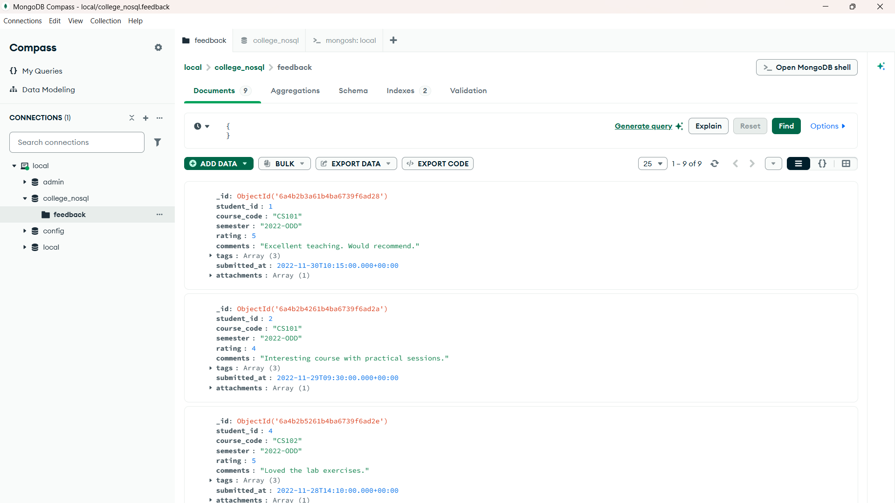
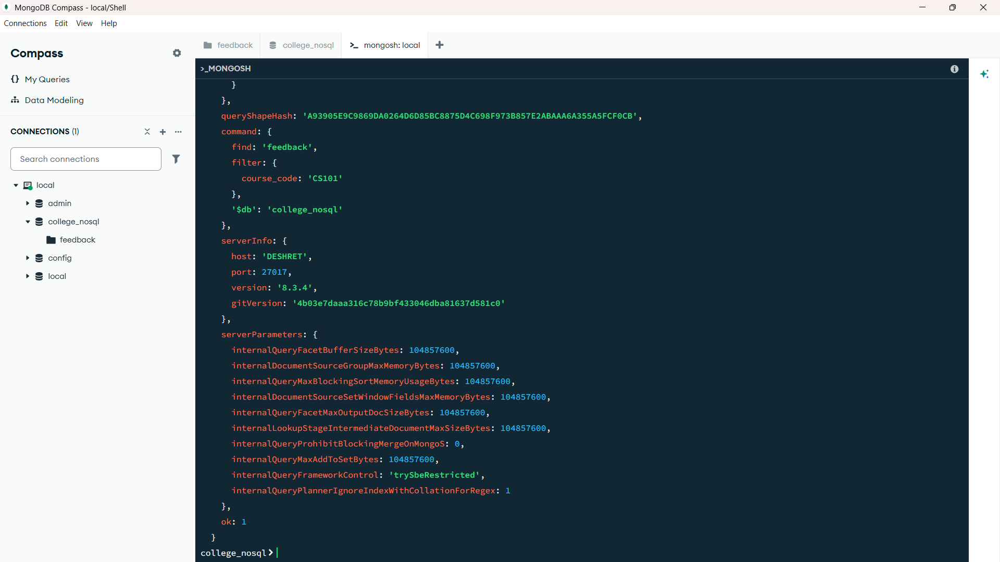
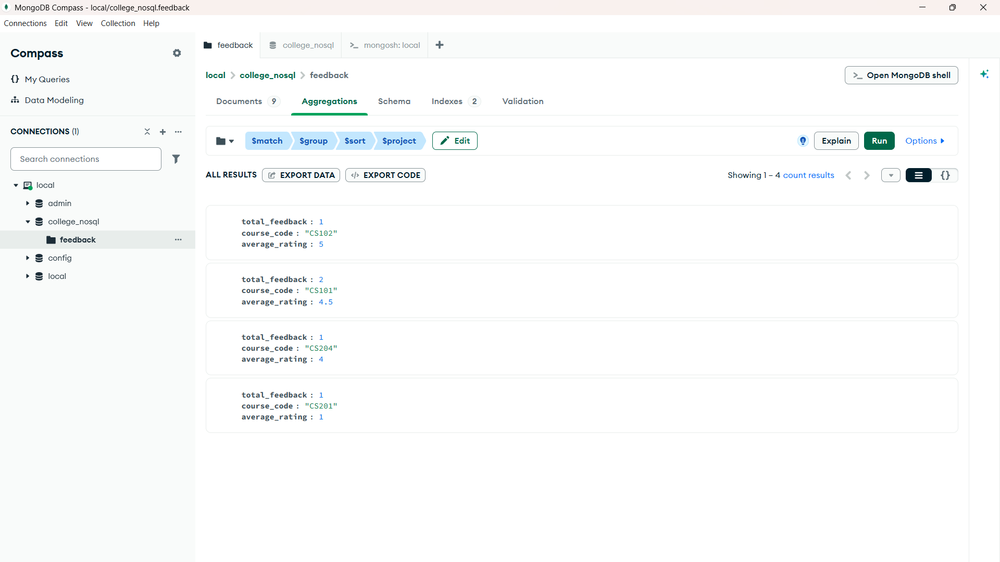
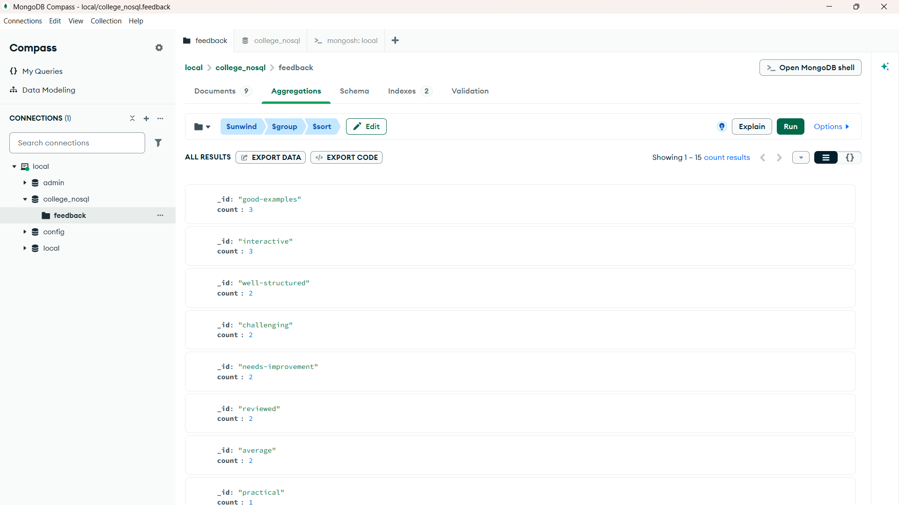
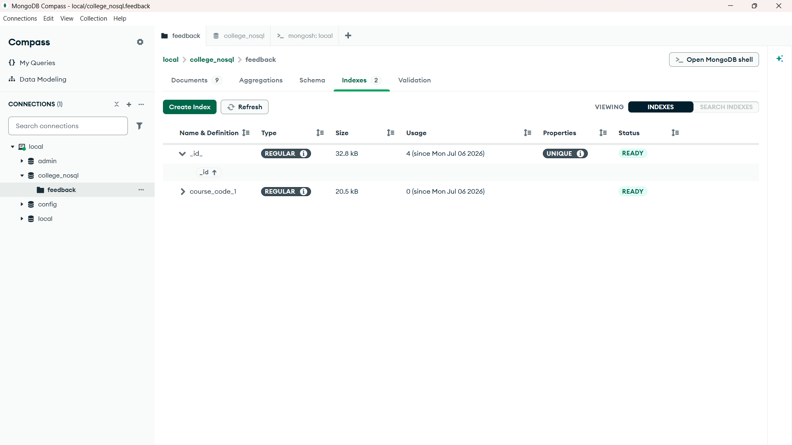

HANDS-ON 5  (Intermediate) -MongoDB — Document Modelling, CRUD & Aggregation

Task 1: Create the Collection and Insert Documents
Goal: Set up the MongoDB collection and insert realistic feedback documents.

Steps:

60. In MongoDB Compass or mongosh, create a database named college_nosql.

61. Create a collection named feedback.

62. Insert at least 10 feedback documents following the schema above. Vary ratings (1–5), tags, and 
semesters. Include at least 3 documents for CS101 and 2 for CS102.

63. Insert one document that intentionally omits the attachments field — MongoDB's schema-less design 
allows this.

64. Verify the inserts using db.feedback.countDocuments().

Task 2: CRUD Operations
Goal: Practise all four CRUD operations on the feedback collection.

Steps:

65. READ: Find all feedback documents where rating is 5.

66. READ: Find feedback for course CS101 where the tags array contains 'challenging'. Use $elemMatch 
or a simple array value query.

67. READ: Retrieve only the student_id, course_code, and rating fields (projection) for all documents — 
exclude _id.

68. UPDATE: For all feedback documents with rating < 3, add a field needs_review: true using 
updateMany and $set.

69. UPDATE: Push a new tag 'reviewed' into the tags array of all documents where needs_review is true, 
using $push.

70. DELETE: Delete all feedback documents where the semester is '2021-EVEN'.

Task 3: Aggregation Pipeline
Goal: Build a multi-stage aggregation pipeline to generate analytical reports.

Steps:

71. Write a pipeline that: (Stage 1) filters to semester '2022-ODD'; (Stage 2) groups by course_code 
calculating average rating and total feedback count; (Stage 3) sorts by average rating descending.

72. Extend the pipeline with a $project stage to rename avg_rating to average_rating and round it to 1 
decimal place using $round.

73. Write a pipeline that uses $unwind on the tags array, then $group by tag to count how many times 
each tag appears. Sort by count descending — a tag frequency leaderboard.

74. Add an index on course_code and verify its usage with 
db.feedback.find({course_code:'CS101'}).explain('executionStats') — confirm the stage shows 
IXSCAN not COLLSCAN.

Pipeline 1

Pipeline 2

Indexes

